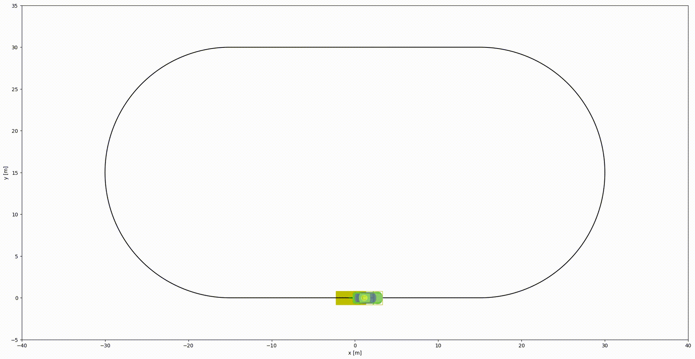

# Mppi

# References

- [python_simple_mppi](https://github.com/MizuhoAOKI/python_simple_mppi/blob/master/notebooks/mppi_pathtracking.ipynb)

  Model Predictive Path-Integral (MPPI) Control [G. Williams et al., 2018] is a promising sampling-based optimal control algorithm.
  This repository is for understanding the basic idea of the algorithm.
